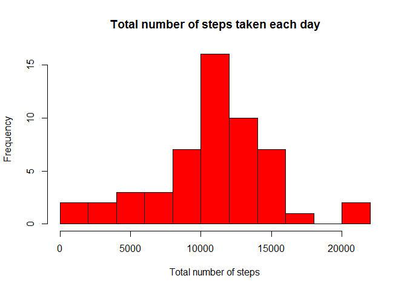
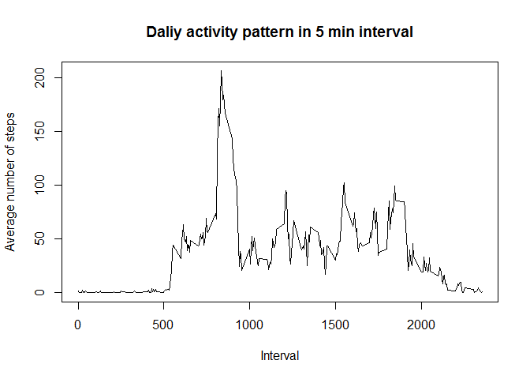
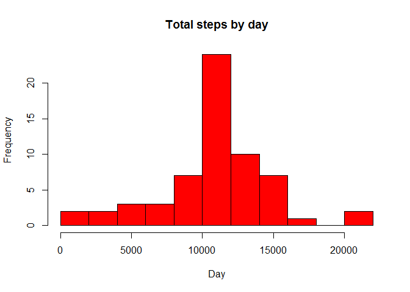
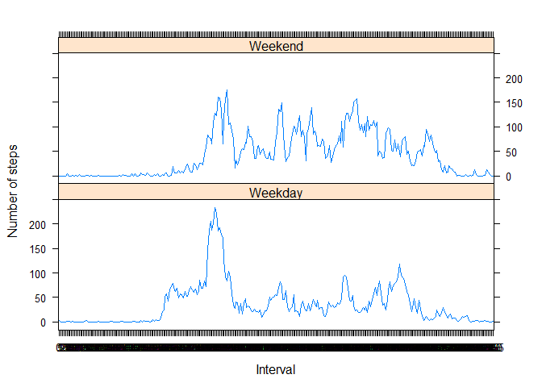

# Coursera Reproducible Research Assignment1

Loading necessary libraries and read the data

```r
library(plyr)
library(lattice)
library(knitr)
activityData <- read.csv('activity.csv', header = TRUE, colClasses=c("numeric", "character", "numeric"))
activityData$date <- as.Date(activityData$date, format = "%Y-%m-%d")
activityData$interval <- as.factor(activityData$interval)
```
##### What is mean total number of steps taken per day?
Clean the data and calculate sums of steps perday

```r
steps_per_day <- aggregate(steps ~ date, activityData, sum)
colnames(steps_per_day) <- c("date","steps")
```

Histogram of total steps per day

```r
hist(steps_per_day$steps, breaks=15, main="Total number of steps taken each day", xlab="Total number of steps", col="red")
```

 


Average number of steps taken by the volunteers: 1.0766189\times 10^{4} and median:1.0765\times 10^{4}

##### What is the daily activity pattern?

```r
intSteps <- aggregate(activityData$steps, by = list(interval = activityData$interval),FUN=mean, na.rm=TRUE)
intSteps$interval <- as.integer(levels(intSteps$interval)[intSteps$interval])
colnames(intSteps) <- c("interval", "steps")
```

Time series plot (i.e. type = 'l') of the 5-minute interval (x-axis) and the average number of steps taken, averaged across all days (y-axis)

```r
plot(intSteps$interval, intSteps$steps, type="l", main="Daliy activity pattern in 5 min interval",xlab="Interval", ylab="Average number of steps")
```

 


```r
maxInterval <- intSteps[intSteps$steps==max(intSteps$steps),]$interval
```

##### Maximum number of steps taken at 835 minutes, i.e. at 13 hours  and 55 minutes from the start of data collection time.

##### Imputing missing values.
Total numberof missing values in the given datare are 2304
For these missing values the strategy to impute the values is to fill missing values with inteval averages.


```r
avgSteps <- aggregate(steps ~ interval, data = activityData, FUN = mean)
fillNA <- numeric()
for (i in 1:nrow(activityData)) {
  obs <- activityData[i, ]
  if (is.na(obs$steps)) {
    steps <- subset(avgSteps, interval == obs$interval)$steps
  } else {
    steps <- obs$steps
  }
  fillNA <- c(fillNA, steps)
}
newActivity <- activityData
newActivity$steps <- fillNA
tidyDataTotSteps <- aggregate(steps ~ date, data = newActivity, sum, na.rm = TRUE)
```

Plotting the histogram with imputed values

```r
hist(tidyDataTotSteps$steps, breaks = 15, main = "Total steps by day", xlab = "Day", col = "red")
```

 

After filling the NA values with mean of the intervals, the average number of steps taken by the volunteers: 1.0766189\times 10^{4} and median:1.0766189\times 10^{4}

##### Differences in activity patterns between weekdays and weekends

```r
day <- weekdays(activityData$date)
dayType <- vector()
for (i in 1:nrow(activityData)) {
  if (day[i] == "Saturday"| day[i] =="Sunday") {
    dayType[i] <- "Weekend"
  } else {
    dayType[i] <- "Weekday"
  }
}
activityData$dayType <- dayType
activityData$dayType <- factor(activityData$dayType)
stepsDayType <- aggregate(steps ~ interval + dayType, data = activityData, mean)
names(stepsDayType) <- c("interval", "dayType", "steps")
```

Time series plot of the 5-minute interval (x-axis) and the average number of steps taken, averaged across all weekdays or weekends (y-axis).

```r
xyplot(steps ~ interval | dayType, stepsDayType, type = "l", layout = c(1, 2), 
         xlab = "Interval", ylab = "Number of steps")
```

 

